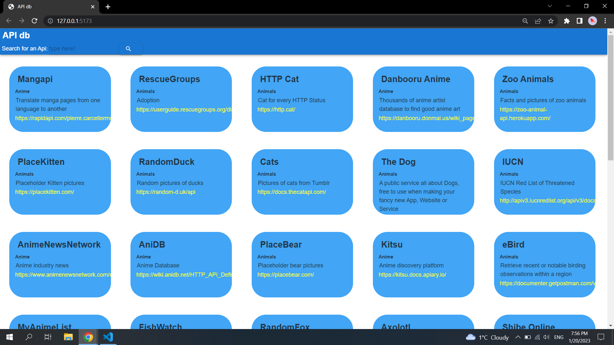
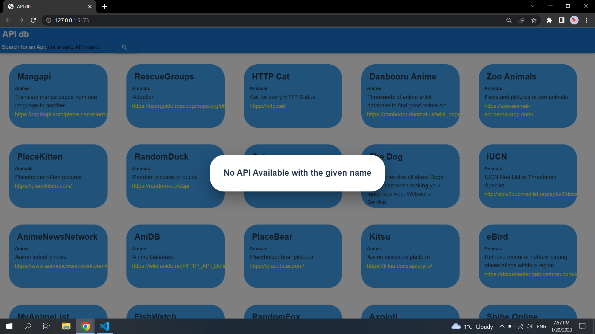
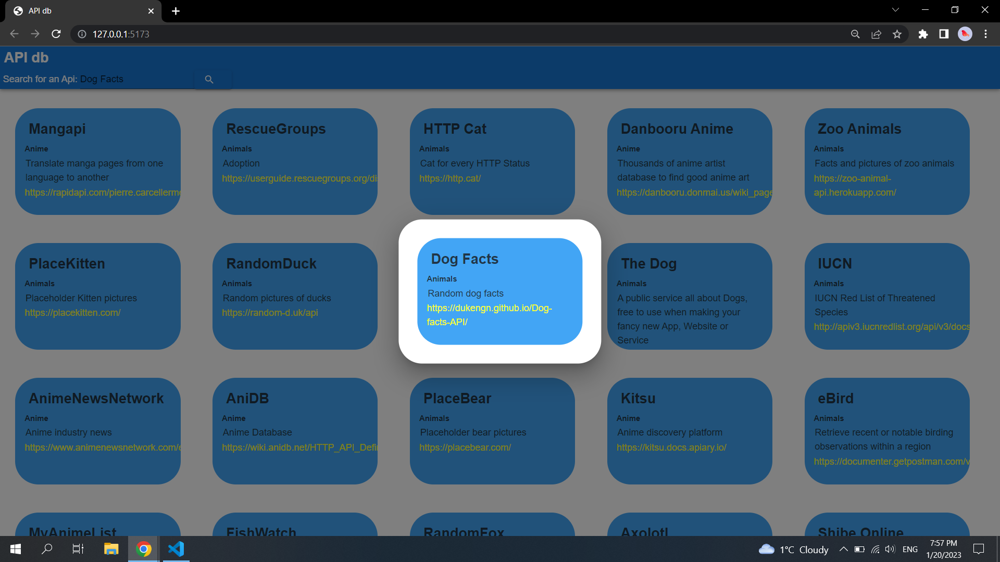

# APIs db

## 
the webpage displays posts for differents APIs. there are 50 posts fetched from the server which connects to mongondb. you can search between more than 1400 APIs available on mongo db by typing the name of the API on the search field.

## test

## Authors

- [@Tarek Habash](https://github.com/tarek797)
